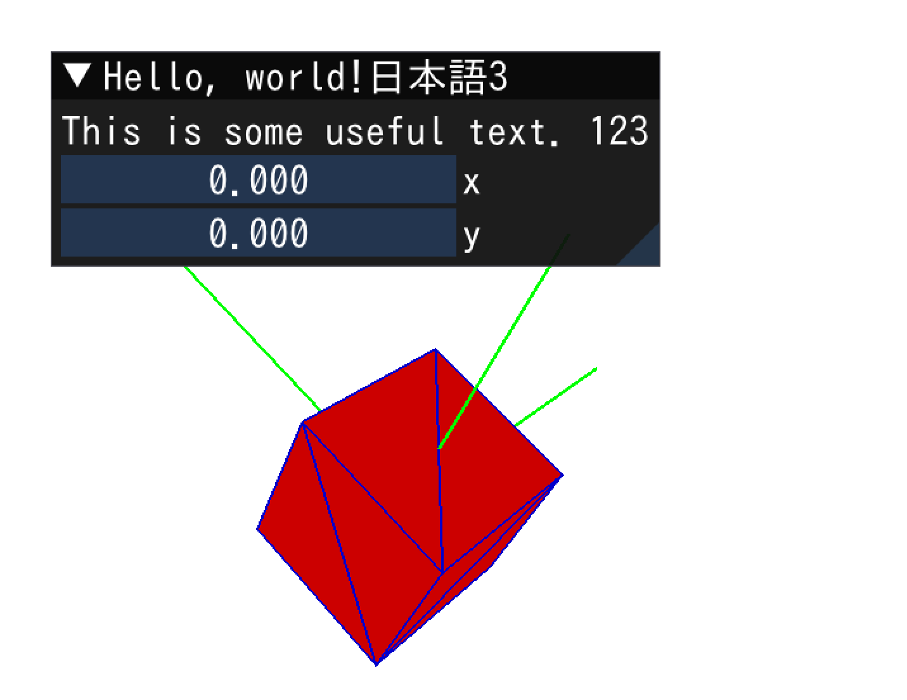

# OpenGL GLFW + GLAD + GLM + Dear ImGui + IXWebSocket Template
A minimal OpenGL starter project using:
# モダンOpenGLのテスト
2026.3.1 -

This project provides a simple structure for experimenting with OpenGL rendering.

---

## Features

- Modern OpenGL (VAO / VBO / EBO)
- GLM matrix transformations
- Dear ImGui debug UI
- Simple Model / Renderer structure
- Edge rendering for mesh visualization
- IXWebSocket interface

---

## Screenshot

---
## EmscriptenによるWebGL化

https://doilab.github.io/glfw64-glm-glad-imGUI/

## WebGLをローカルで試す場合

別ターミナルで

python3 -m http.server 8080

ブラウザで

localhost:8080

にアクセス

---

## Project Structure

src/

include/
nlohmann/json

third_party/
imgui/
glad/
glm/
GLFW/

assets/
fonts, STL files

docs/
HTML files

---

## Build

### Web(em++)

make linux-web

### Linux (g++)

make linux

### Windows (MinGW g++)

make win64

### Linux websocket server (g++)

make websocket-test

---

## Dependencies

- GLFW (window / input) https://www.glfw.org/
- GLAD (OpenGL loader) https://glad.dav1d.de/
- GLM (math library) https://github.com/g-truc/glm
- Dear ImGui (debug UI) https://github.com/ocornut/imgui
- Emscripten compiler https://emscripten.org/
- nlohmann JSON https://github.com/nlohmann/json
- WebSocket++ https://github.com/zaphoyd/websocketpp/
- IXWebSocket 

---

## Future improvements

- WebSocket test
- Animation
- Menu

---
