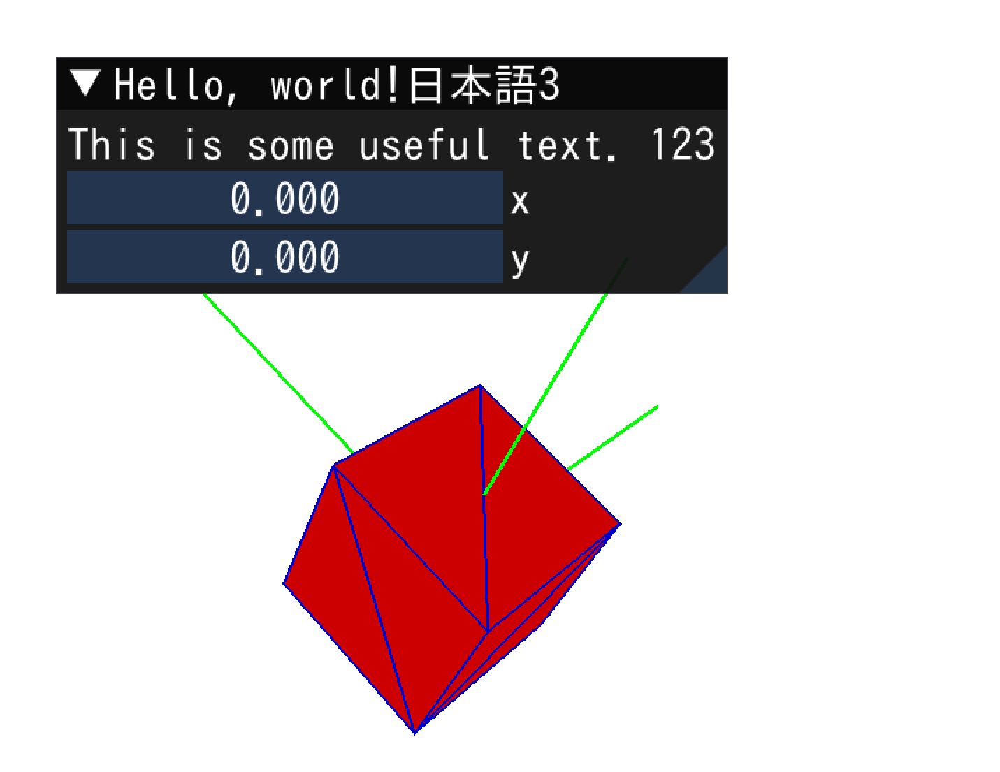

# OpenGL GLFW + GLAD + GLM + Dear ImGui + IXWebSocket Template
A minimal Modern OpenGL starter project
2026.3.1 -

This project provides a simple structure for experimenting with OpenGL rendering.

---

## Features

- Modern OpenGL (VAO / VBO / EBO)
- GLM matrix transformations
- Dear ImGui debug UI
- Simple Model / Renderer structure
- Edge rendering for mesh visualization
- IXWebSocket interface
- Multi platform (Windows/Linux/WebGL)

---

## Screenshot



---
## WebGL program by Emscripten compiler

https://doilab.github.io/glfw64-glm-glad-imGUI/


## Project Structure

src/

include/
nlohmann/json

third_party/
imgui/
glad/
glm/
GLFW/

assets/
fonts, STL files


docs/
HTML files


---

## Build

### Web(em++)
```
make linux-web
```

### Linux (g++)
```
make linux
```

### Windows (MinGW g++)
```
make win64
```

### Linux websocket server (g++)
```
make websocket-test
```

---

## Dependencies

- GLFW (window / input) https://www.glfw.org/
- GLAD (OpenGL loader) https://glad.dav1d.de/
- GLM (math library) https://github.com/g-truc/glm
- Dear ImGui (debug UI) https://github.com/ocornut/imgui
- Emscripten compiler https://emscripten.org/
- nlohmann JSON https://github.com/nlohmann/json
- WebSocket++ https://github.com/zaphoyd/websocketpp/
- IXWebSocket 

---
## WebGLをローカルで試す場合

別ターミナルで
```
python3 -m http.server 8080
```
ブラウザで
```
localhost:8080
```
にアクセス


---
## Tips
~/.zshrcに以下追記しておく．
`emdev`
と実行しただけでemscriptenにパスが通り，ローカルWebサーバーが起動し，VSCodeが実行される．

```
emdev() {
    # Emscripten環境
    source ~/emscripten/emsdk/emsdk_env.sh

    DEV=~/Projects/glfw64-glm-glad-imGUI/
    DOCS=$DEV/docs
    PORT=${1:-8080}

    cd "$DEV" || return

    # Webサーバー起動（起動していない場合）
    if ! lsof -i :$PORT >/dev/null 2>&1; then
        (cd "$DOCS" && python3 -m http.server $PORT) &
        echo "Web server started: http://localhost:$PORT"
    else
        echo "Server already running on port $PORT"
    fi

    code .
}
```

---
## Future improvements

- WebSocket test
- Animation
- Menu


---
## 概略をつかむには
App.cppに全体の流れがあるので参照する．

## 視点移動（今後変更の可能性あり）
- 左右矢印キー　パン
- 上下矢印キー　視点の高さ変更
- PageUp/Down ズーム


---
